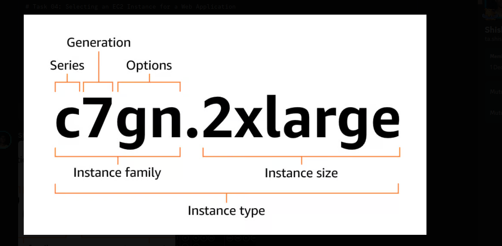

**Instance Families**,
	**General Purpose**
		-- balanced compute, memory, and networking resources
	**Compute Optimized**
		-- high performance computing, batch processing
	**Memory Optimized** 
		-- in memory databases, real-time analytics, and jobs that require substantial amount of RAM
	**Storage Optimized**
		-- for low latency high throughput I/O

**Instance Naming Convention**,

| Series                                               |
| ---------------------------------------------------- |
| C - compute optimized                                |
| D - dense storage                                    |
| Hpc - high performance computing                     |
| I - storage optimized                                |
| Im - storage optimized (1 to 4 ratio of vCPU memory) |
| Is - storage optimized (1 to 6 ratio of vCPU memory) |
| Inf - aws inferentia                                 |
| M - general purpose                                  |
| Mac - macOS                                          |
| P - GPU accelerated                                  |
| R - memory optimized                                 |
| T - burstable performance                            |
| Trn - aws trainium                                   |
| U - high memory                                      |
| VT - video transcoding                               |
| X - memory intensive                                 |
| Z - high memory                                      |

| Options                                                                                                                                                                            |     |
| ------------------------------------------------------------------------------------------------------------------------------------------------------------------------------------- | --- |
| a - amd processor                                                                                                                                                                     |     |
| b \* 00 \| gb \* 00 - accelerated by NVIDIA Blackwell GPUs                                                                                                                            |     |
| g - aws graviton processor                                                                                                                                                            |     |
| i - intel processor                                                                                                                                                                   |     |
| m \* \| m \*  pro - apple chip                                                                                                                                                        |     |
| b - block storage optimization                                                                                                                                                        |     |
| d - instance store volumes                                                                                                                                                            |     |
| e - extra instance storage (for storage optimized instance types), extra memory (for memory optimized instance types), or extra GPU memory (for accelerated computing instance types) |     |
| flex - instance                                                                                                                                                                       |     |
| n - network and ebs optimized                                                                                                                                                         |     |
| q - qualcomm inference accelerators                                                                                                                                                   |     |
| \* tb - amount of memory of high memory instances (3 TiB to 32 TiB)                                                                                                                   |     |
| z - high CPU frequency                                                                                                                                                                |     |

## Instance Selection

#### Goal 
To find an instance that is best fit for the application.
#### Prerequisite
Need to know the application/workload,
- What are the business requirements?
- What are the bottlenecks?

### What if I'm unsure about the key constraints?
1. Start with the best guess instance
	- have large dataset and need high disk capacity
	- use hardware knowledge i.e. it's well known that GPUs are good for certain things
	- consult developers who wrote the application they should know if it's going to be CPU intensive, etc.
2. Then determine the constraint resource
	- observe resource utilization from actual load
	- create a benchmark or load test
3. Choose a instance for the constrained resource

### Few specific use cases
Your application runs on linux and is based on open-source software / frameworks.
- AWS Graviton2-based instances have the best $/perf ratio (C6g/M6g/R6g/T4g)
You need an instance without virtualization.
- \*.metal instances
You need lots of cores but not a high floating-point peak performance.
- AMD based instances are cheaper alternatives to Intel-based instances
You need lowest cost machine learning inference in the cloud with high performance.
- Use inf1 instances
You need and FPGA
- Use F1 instances with Xilinx FPGAs

Utilize AWS Cloud Optimizer or CloudWatch or other benchmarking tools to better understand resource constraints.

# Task 04: Selecting an EC2 Instance for a Web Application

### 1. Workload Category Analysis
* **Family:** **General Purpose (T-series)**
* **Performance Profile:** Web applications are typically **bursty**. They remain relatively idle during low traffic but require high CPU for request spikes, API calls, and Server-Side Rendering (SSR).
* **Cost Efficiency:** T-series instances use a "CPU Credit" system, making them significantly cheaper than M-series (Fixed Performance) for workloads that don't run at 100% CPU utilization constantly.

### 2. Architecture Selection: Why T4g?
Since the application architecture is ARM-compatible (also runs on Linux-based systems), the **T4g family** is better choice over the T3 (Intel) family.

* **Price-Performance:** Offers up to **40% better price-performance** than T3.
* **Lower Unit Cost:** Approximately **20% cheaper** hourly rate than equivalent x86 instances.
* **Modern Hardware:** Powered by **AWS Graviton2** processors, which are optimized for cloud-native applications and microservices.

### 3. Sizing Comparison

| Instance Size | vCPU | Memory (GiB) | Best For                                                                              |
| :------------ | :--: | :----------: | :------------------------------------------------------------------------------------ |
| **t4g.micro** |  2   |     1.0      | Small APIs, development environments, and low-traffic hobby sites.                    |
| **t4g.small** |  2   |     2.0      | **Production baseline.** Ideal for Next.js SSR and ASP.NET Core with small databases. |

---

### **Final Choice: T4g.small**
**Rationale:** 
1.  **Memory Buffer:** ASP.NET Core runtimes and Next.js build processes often struggle with 1GB of RAM (`micro`). The 2GB provided by the `small` ensures stability during deployments.
2.  **Extended Free Trial:** AWS offers 750 hours/month of **t4g.small** for free until December 31, 2026, making it more cost-effective than the `micro` for the current year.
